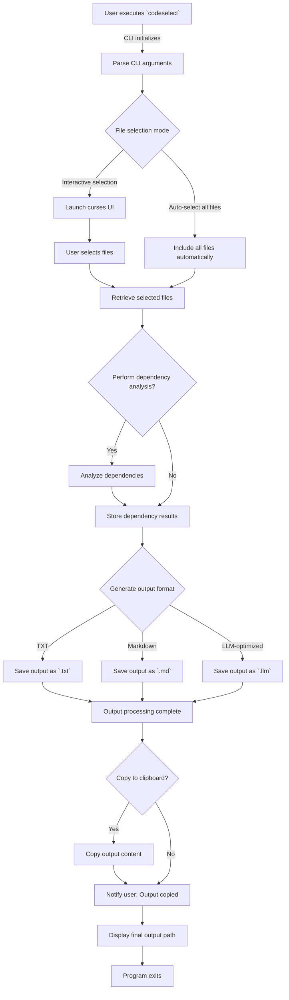

```mermaid
graph TD;
    A[User executes `codeselect`] -->|CLI initializes| B[Parse CLI arguments]
    
    B --> C{File selection mode}
    C -->|Interactive selection| D[Launch curses UI]
    C -->|Auto-select all files| E[Include all files automatically]

    D --> F[User selects files]
    F --> G[Retrieve selected files]
    E --> G

    G --> H{Perform dependency analysis?}
    H -->|Yes| I[Analyze dependencies]
    I --> J[Store dependency results]
    H -->|No| J

    J --> K{Generate output format}
    K -->|TXT| L[Save output as `.txt`]
    K -->|Markdown| M[Save output as `.md`]
    K -->|LLM-optimized| N[Save output as `.llm`]

    L --> O[Output processing complete]
    M --> O
    N --> O

    O --> P{Copy to clipboard?}
    P -->|Yes| Q[Copy output content]
    Q --> R[Notify user: Output copied]
    P -->|No| R

    R --> S[Display final output path]
    S --> T[Program exits]
```