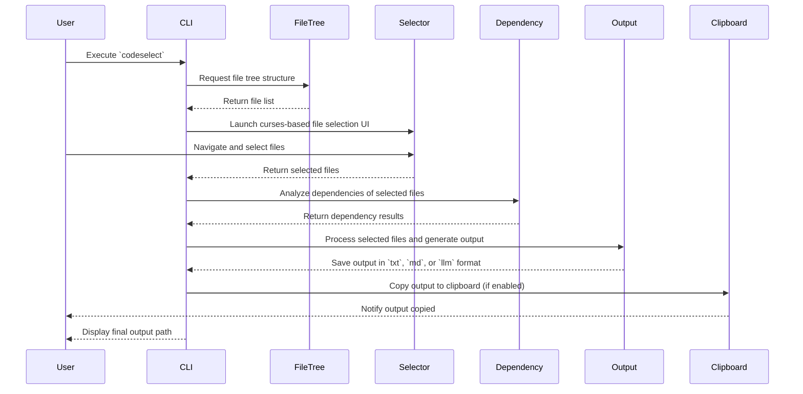

```mermaid
sequenceDiagram
    participant User
    participant CLI
    participant FileTree
    participant Selector
    participant Dependency
    participant Output
    participant Clipboard

    User->>CLI: Execute `codeselect`
    CLI->>FileTree: Request file tree structure
    FileTree-->>CLI: Return file list

    CLI->>Selector: Launch curses-based file selection UI
    User->>Selector: Navigate and select files
    Selector-->>CLI: Return selected files

    CLI->>Dependency: Analyze dependencies of selected files
    Dependency-->>CLI: Return dependency results

    CLI->>Output: Process selected files and generate output
    Output-->>CLI: Save output in `txt`, `md`, or `llm` format
    CLI->>Clipboard: Copy output to clipboard (if enabled)
    Clipboard-->>User: Notify output copied
    CLI-->>User: Display final output path
```